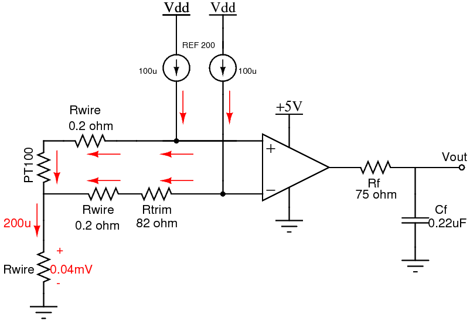

# PT100-AFE
Analog Front-End for the PT100 temperature sensor inside the HIMA temperature chamber.

||
|:--:|
|*Figure 1: Block Diagram of PT-100 AFE*|

[Click Here](/Python/pt100-datasheet.csv) to get the PT-100 Temperature vs. Resistance Data.

# Analog Front-End (AFE) Architecture

## 1. Design Summary
The Design requirements are as follows:
- Supply voltage: 5V
- RTD Temperature range: -40℃ to 151℃
- RTD Resistance range: 84.27Ω to 157.69Ω
- Output Range: 0V to 5V

## 2. Theory of operation

 - Figure 2 shows the schematic of the Resistance Temperature Detector (RTD) amplifier for minimum and maximum output conditions. Note that this circuit was designed for a -40℃ to 151℃ RTD temperature range.
 - At -40℃ the RTD resistance is 84.27Ω and the voltage across it is 8.427mV (VRTD = (100μA)(84.27Ω)). 
 - Here Rtrim develops a voltage drop that opposes the RTD drop. The drop across Rtrim is used to shift amplifiers input differential voltage to a minimum level. 
 - The output is the differential input multiplied by the gain (Vout = 659.67 x 227μV = 0.1497V). 
 - At 151℃ the RTD resistance is 157.69Ω and the voltage across it is 15.769mV (VRTD = (100μA)(157.69Ω)). 
 - This produces a differential input of 7.569mV and an output voltage of 4.9930V (Vout = 659.67 x 7.569mV = 4.9930V).

||
|:--:|
|*Fig 2: RTD Amplifier with minimum and maximum output condition*|

### 2.1. **Lead Resistance cancelation (3 wire RTD)**
	
 - Figure 3 below shows the three wire RTD configuration can be used to cancel lead resistance.Note that the resistance in each lead must be equal to cancel the error. Also, the two current sources in the REF200 need to be equal. 
 - Here the voltage developed on the two top leads of the RTD are equal and opposite polarity so that the amplifiers input is only from the RTD voltage. 
 - At 151C, the RTD drop is 15.679mV and the leads each have 0.02mV. Therefore, 0.02mV drops cancel. 
 - Finally, the voltage on the 3rd lead (0.04mV) creates a small shift in the common mode voltage. However, the INA826 has a rail to rail common mode range, so it can accept common mode voltages near ground.

||
|:--:|
|*Figure 3: Schematic of AFE*|

### 2.2 Noise Calculation
#### Resistor Noise

For Analysis purpose, Rwire = 20Ω, Temperature = 45℃(318k), B.W. = 30KHz

||
|:--:|
|*Figure 4: Resistance Noise* |

Resistance Noise  | Value (nV/Hz^0.5) |
 ------------ | :-----------: | 
Vnr1      |          1.34 |
Vnr2       |   2.1  | 
Vnr3       |   0.6  |

#### Current Noise

From the datasheet of INA826 current noise = 

||
|:--:|
|*Figure 5: Current Noise*|

Current Noise  | Value (pV/Hz^0.5) |
 ------------ | :-----------: | 
Vnc1      |          1.8 |
Vnc2       |   1.02  | 
Vnc3       |   0.4  | 

#### Voltage Noise

#### Total Noise for a Bandwidth of 30KHz
 

 ### 2.3 Selecting Gain and Offset Resistor

- Calculate the required Gain (ΔVout/ΔVin)

	
- Choose standard resistors to assure that the actual gain is equal to or less than the calculated gain. From INA826 data sheet we get the gain equation as:
	

	
- Calculate a value of R3 based on the minimum output voltage and the gain
R3 = 82Ω (standard value)

### 2.4 External Low Pass Filter
- Given that when G = 1000, BandWidth = 6KHz (From Data sheet of INA826)
- In this operation G = 659.67, So B.W. = 9.1KHz
- calculating the value of Rf and Cf
 

From this equation
Rf = 75Ω & Cf = 0.22uF

## 3. PCB Design
This PCB layout was designed using [Autodesk Eagle](https://www.autodesk.in/products/eagle/overview). For the components we have used [SparkFun Eagle Libraries](https://github.com/sparkfun/SparkFun-Eagle-Libraries). The footprints of the ICs(INA 826, REF200) can be downloaded from the [Ultra Librarian](https://www.ultralibrarian.com/).

### 3.1. Electrical Schematic

||
|:--:|
|*Figure 6:Electrical Schematic*|

### 3.1. PCB Layout

#### PCB Guidelines

 - Fine-Tuning Your Component Placement
 - Placing Your Power, Ground & Signal Traces
 - Keeping Things Separate
 - Placing the decoupling capacitors nearer to the IC pins
 - Checking Your Layout Against Your PCB Design Rules
 

||
|:--:|
|*Figure 7: PCB Top - Red*|

||
|:--:|
|*Figure 8: PCB Bottom - Blue*|

### 3.2. Component Selection

[Click Here](/PCB/bill_of_comp.csv) to get the bill of components.

# Analog Discovery 2
## Specification
- 14 Bit ADC
- Voltage Range: -25V to 25V

## Operation
### Calculating Bit of operation we need 
- Required voltage range: 0-5V
- So, we need to use 11 Bit ADC (Voltage Range: 0-6.25V)

### LSB Calculation
- Temperature Range: -40℃ to 151℃
- No of Samples 192, we have taken 256(2^8) no. of samples
- So we can represent 1℃ using 8bit
- *For 11 Bit of operation LSB = 0.125℃*

## Analysis using Python
### Resistance Vs Temperature Plot

||
|:--:|
|*Fig 9: Resistance Vs Temperature*|

### AFE o/p Voltage Vs Temperature Plot

||
|:--:|
|*Fig 10: AFE o/p Voltage Vs Temperature*|

### Code Vs Temperature Plot

||
|:--:|
|*Fig 11: Code Vs Temperature*|

### Error Vs Temperature Plot

||
|:--:|
|*Fig 12: Error Vs Temperature*|

[Click Here](/Python/pt100.py) to get the python code.
